*<u>Aves Terrestres</u>* *<u>y de Agua Dulce</u>*

> 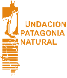 style="width:0.54808in;height:0.63368in" /> style="width:0.38368in;height:0.27604in" /> style="width:0.50448in;height:0.48698in" /> style="width:0.29253in;height:0.62683in" /> style="width:0.87066in;height:0.34809in" />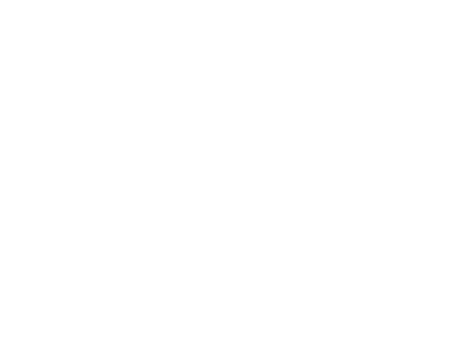 style="width:2.55556in;height:1.9566in" />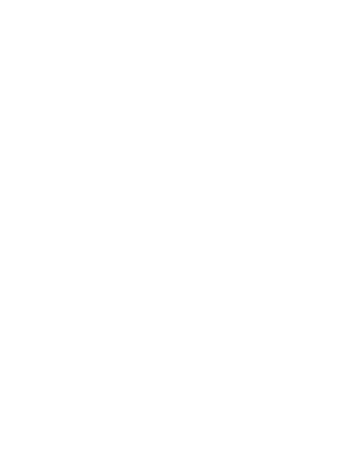 style="width:1.75694in;height:2.36632in" /> style="width:0.14149in;height:0.30122in" />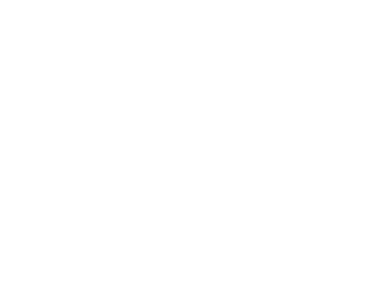 style="width:2.35156in;height:1.78733in" />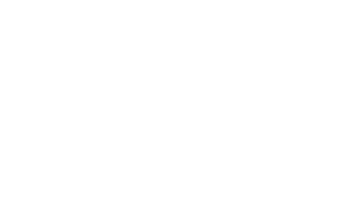 style="width:2.15885in;height:1.34896in" />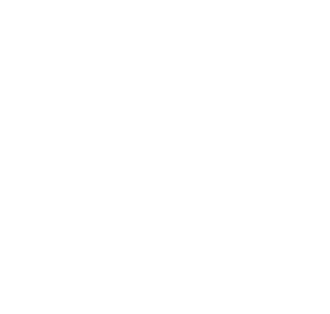 style="width:2.04861in;height:1.95486in" />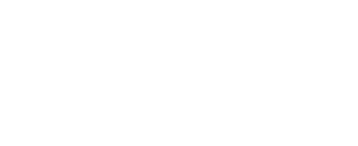 style="width:2.50174in;height:1.01302in" /> style="width:0.21267in;height:0.84635in" />Área Educación Ambiental -
> Fundación Patagonia Natural
>
> ***2***

*<u>Aves Terrestres</u> y <u>de Agua Dulce
</u>*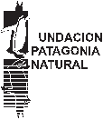

> **Área** **Educación** **Ambiental** **-** **Fundación** **Patagonia**
> **Natural**
>
> **Consolidación** **e** **Implementación** **del** **Plan** **de**
> **Manejo** **Integrado**
>
> **de** **la** **Zona** **Costera** **Patagónica** **para** **la**
> **Conservación** **de** **la** **Biodiversidad** **ARG/02/G31**
>
> ***3***

**El** **Programa** **de** **Educación** **Ambiental** **de** **la**
**Fundación** **Patagonia** **Natural,** **fue** **declarado** **de**
**interés** **por** **la** **Subsecretaría** **de** **Planificación**
**y** **Política** **Ambiental.** **Secretaría** **de** **Ambiente**
**y** **Desarrollo** **Sustentable.** **Jefatura** **de** **Gabinete**
**de** **Ministros.** **Disposición** **N°** **1/08.**

**Elaboración** **de** **los** **textos** **por** **orden**
**alfabético:** Alexandra Sapoznikow,

Cecilia Reeves, Griselda Sessa y Martín de la Reta.

**Introducción:** Christian Savigni

**Ilustraciones:** Guillermo Harris

**Diseño:**

Jimena M. Esteves I.

**Fundación** **Patagonia** **Natural** Marcos A. Zar 760

\(9120\) Puerto Madryn - Chubut

Tel/Fax: (02965) 451920 / 472023 / 474363 E-mail:
pnatural@patagonianatural.org www.patagonianatural.org

> ***4***

***Indice***

Prólogo.........................................................................................................................................................................*7*

Fundación Patagonia
Natural...................................................................................................................................*9*

Contenido de las fichas de Aves
Terrestres............................................................................................................*11*

Introducción................................................................................................................................................................*13*

Choique - *Pterocnemia*
*pennata.....................................................................................................................................15*

Martineta Común - *Eudromia*
*elegans........................................................................................................................16*

Macá Tobiano - *Podiceps*
*gallardoi...............................................................................................................................17*

Macá Grande o Huala - *Podiceps*
*major.....................................................................................................................18*

Garza Blanca - *Casmerodius*
*albus...............................................................................................................................19*

Garza Bruja - *Nycticorax*
*nycticorax............................................................................................................................20*

Bandurria Austral - *Theristicus*
*melanopis*...................................................................................................................*21*

Flamenco Austral - *Phoenicopterus*
*chilensis................................................................................................................22*

Coscoroba - *Coscoroba*
*coscoroba..................................................................................................................................23*

Cisne de Cuello Negro - *Cygnus*
*melancoryphus........................................................................................................24*

Cauquén Común - *Chloephaga*
*picta...........................................................................................................................25*

Cauquén Colorado - *Chloephaga*
*rubidiceps*................................................................................................................*26*

Pato Crestón - *Lophonetta*
*specularioides.....................................................................................................................27*

Pato Maicero - *Anas*
*georgica......................................................................................................................................28*

Pato Vapor Cabeza Blanca - *Tachyeres*
*leucocephalus.................................................................................................29*

Jote Cabeza Colorada - *Cathartes*
*aura......................................................................................................................30*

Águila Mora - *Geranoaetus*
*melanoleucus......................................................................................................................31*

Aguilucho Común - *Buteo* *polyosoma*
*.........................................................................................................................32*

Carancho - *Polyborus*
*plancus.......................................................................................................................................33*

Chimango - *Milvago*
*chimango*.....................................................................................................................................*34*

Halcón Peregrino - *Falco*
*peregrinus............................................................................................................................35*

Gallareta Chica - *Fulica*
*leucoptera..............................................................................................................................36*

Tero Real - *Himantopus*
*melanurus..............................................................................................................................37*

Tero Común - *Vanellus*
*chilensis.................................................................................................................................38*

Paloma Torcaza - *Zenaida*
*auriculata..........................................................................................................................39*

Loro Barranquero - *Cyanoliseus*
*patagonus.................................................................................................................40*

Lechuza de Campanario - *Tyto*
*alba..........................................................................................................................42*

Ñacurutú - *Bubo*
*virginianus........................................................................................................................................43*

Lechucita Vizcachera - *Athene*
*cunicularia.................................................................................................................44*

Atajacaminos Ñañarca - *Caprimulgus*
*longirostris......................................................................................................45*

Bandurrita Común - *Upucerthia*
*dumetaria................................................................................................................46*

Sobrepuesto - *Lessonia*
*rufa........................................................................................................................................47*

> ***5***

Calandria Mora - *Mimus*
*patagonicus..........................................................................................................................48*

Zorzal Patagónico - *Turdus* *falcklandii*
*......................................................................................................................49*

Yal Negro - *Phrygilus*
*fruticeti......................................................................................................................................50*

Chingolo - *Zonotrichia*
*capensis....................................................................................................................................51*

Loica Común - *Sturnella*
*loyca.....................................................................................................................................52*

Categorías
UICN........................................................................................................................................................*53*

Bibliografía...................................................................................................................................................................*55*

> ***6***

***Prólogo***

Desde hace aproximadamente 130 millones de años las aves sobrevuelan y
habitan la tierra, adap-tándose a ecosistemas tan diversos como los
bosques, los desiertos, las montañas y las praderas, evolucionando en
torno a su capacidad de vuelo.

Las aves que viven relacionadas a ambientes terrestres dependen en
cierto grado de los cursos de agua dulce como ríos, lagos y lagunas.

Algunas permanecen en una misma región durante todo el año, otras en
cambio, se alejan de sus sitios de reproducción y emprenden fabulosas
migraciones en busca de alimento.

Nos emocionan con sus diferentes cantos, siempre con un destino, ya sea
como señal de alarma, para atraer a su pareja o como defensa de su
territorio.

La transformación del paisaje, la pérdida de su hábitat natural, el uso
de agroquímicos y el cambio climático son algunas de sus crecientes
amenazas. Algunas de nuestras aves nativas están siendo diezmadas en
forma silenciosa, principalmente por el desconocimiento que existe sobre
ellas y la falta de acciones de conservación.

Una de las mejores muestras del compromiso con la conservación de estas
especies, es la creación de áreas protegidas que tengan un estricto
criterio ecosistémico y de conservación. En este senti-do creemos que
una comunidad informada y participativa será la garantía de su
supervivencia.

Desde el área de Educación Ambiental de la Fundación Patagonia Natural
nos sentimos honrados de presentarles un material que esperamos sea
incorporado al trabajo educativo en el aula, a fin de contribuir con la
formación de personas capaces de tomar decisiones sobre nuestra calidad
de vida y trabajar por la conservación de las especies.

Este es un trabajo coordinado y realizado por un grupo de especialistas
que con un alto compro-miso sostienen procesos de concientización a
través del uso de la Educación Ambiental como herramienta.

> José María Musmeci Coord. General Proy. ARG/02/G31
>
> Fundación Patagonia Natural
>
> Griselda Sessa Coord. Área Educación

Proy. ARG/02/G31 Fundación Patagonia Natural

> ***7***
>
> ***8***

***Fundación*** ***Patagonia*** ***Natural***

La **Fundación** **Patagonia** **Natural** es una organización no
gubernamental creada en julio de 1989 con el objetivo de promover la
conservación de la flora y la fauna, proteger el ambiente patagónico y
propiciar el manejo res-ponsable de sus recursos y ecosistemas.

Entre otros proyectos, de 1993 a 1996 ejecutó el “Plan de Manejo de la
Zona Costera Patagónica” ARG/92/G31, con financiamiento del Fondo para
el Medio Ambiente Mundial (GEF) y administración del Programa de
Naciones Unidas para el Desarrollo (PNUD). En este marco se relevó y
diagnosticó el estado de la fauna, pesca, turismo y con-taminación de
dicha zona, información base para elaborar una serie de recomendaciones
tendientes al uso responsa-ble de los recursos costeros. En su Primera
Fase abarcó tres provincias patagónicas: Río Negro, Chubut y Santa Cruz.

Actualmente se está ejecutando el proyecto “Consolidación e
Implementación del Plan de Manejo de la Zona Costera Patagónica para la
Conservación de la Biodiversidad” (ARG/02/G31 GEF/PNUD), 2ª Fase de
aquella ini-ciativa. Se propone la continuación de las actividades
iniciadas durante la primera fase, y el fortalecimiento del marco
institucional que facilite una planificación a largo plazo, en base a un
manejo que asegure la conservación de la biodi-versidad; en el mismo
sentido, se iniciaron sub-programas para estimular la adopción de
prácticas productivas cohe-rentes con la conservación; está en marcha
una red de Áreas Protegidas Patagónicas; se están desarrollando
progra-mas de concientización sobre el valor de la biodiversidad marina
y costera. Esta fase se implementa en las cuatro Provincias de la
Patagonia, repitiendo la experiencia de la Fase Piloto en la cuarta
provincia, Tierra del Fuego.

En este marco, el Área de Educación de Fundación Patagonia Natural lleva
adelante diversas propuestas de capa-citación destinadas a docentes,
agentes de conservación, guías de turismo, así como actividades y
programas en los que participan alumnos y docentes de la zona costera
patagónica. Todos los participantes reciben material didáctico
ela-borado y distribuido desde el área.

El objetivo de las capacitaciones es generar cambios actitudinales que
repercutan en la valoración y respeto por el medio ambiente, y en la
incorporación de nuevas metodologías educativas.

Las propuestas apuntan a la educación en valores, y a facilitar la
apropiación de saberes de una manera activa, un proceso dinámico en el
que agentes de conservación, guías de turismo, docentes y alumnos
participan, a través de la acción, en la construcción del conocimiento
sobre el ambiente patagónico, la biodiversidad regional, sus amenazas y
los problemas de conservación a los que se enfrentan diariamente.

> ***9***
>
> ***10***

***Contenido*** ***de*** ***las*** ***Fichas*** ***de*** ***Aves***
***Terrestres*** ***y*** ***de*** ***Agua*** ***Dulce***

Esta colección de fichas de flora y fauna de la costa patagónica está
organizada en cinco secciones: mamíferos mari-nos, aves marinas y
playeras, mamíferos terrestres, aves terrestres y de agua dulce, y
flora. Las fichas constituyen una herramienta de gran utilidad para
docentes, alumnos, guías de turismo, agentes de conservación y toda
persona inte-resada en la naturaleza de la zona costera patagónica.

Las fichas de Aves Terrestres y de Agua Dulce presentan 36 especies que
han sido seleccionadas por ser las más fáci-les de observar en toda la
costa patagónica, o por ser notoriamente abundantes en alguna localidad.
Otras, poco comu-nes, fueron elegidas en función de que su problemática
de conservación necesita ser conocida.

Al inicio de esta sección el lector encontrará una **Introducción** en
la que se detallan las características de las aves en general, y de las
aves terrestres y de agua dulce. De este modo, se brinda información
sobre sus adaptaciones ana-tómicas y fisiológicas, su biología
reproductiva, comportamiento de alimentación, y estado de conservación.
Por ser ésta una publicación de divulgación, destinada a un público muy
diverso, no se incluye la clasificación sistemática de las especies.

A continuación de esa Introducción, se presenta una **Ficha** para cada
una de las especies, en las que se desarrolla la siguiente información:

*Nombre* *vulgar* *de* *la* *especie.* ***Nombre*** ***científico.***

***Distribución.***

Se indican los límites geográficos del área donde habita la especie y su
distribución detallada en la Patagonia. También se incluyen datos sobre
sus movimientos migratorios.

***Dimensiones.***

Tamaño aproximado que el observador otorga al animal adulto en su
postura más habitual. En general se refiere al largo de animal, desde el
pico hasta la cola. En algunos casos se incluye también la envergadura
alar (largo de las dos alas extendidas).

***Peso.***

Refiere el peso promedio del individuo adulto.

***Características*** ***morfológicas.***

Se mencionan las características que permiten identificar a la especie.

***Comportamiento*** ***General.***

Se comentan aquellos aspectos de la conducta que le son característicos.

***Alimentación.***

Se describe la dieta y las técnicas de alimentación utilizadas por cada
especie.

***Reproducción.***

Informa sobre su periodo reproductivo y tiempo de incubación.

> ***11***

***Estado*** ***de*** ***Conservación.***

Se presentan los principales problemas de conservación de cada especie,
y su categorización por la UICN (Unión Mundial para la Naturaleza). La
descripción de este sistema de categorías se encuentra al final de la
sección.

Cada Ficha está ilustrada con un dibujo que permite identificar a la
especie. Las ilustraciones son obra de Guillermo Harris, y fueron
publicadas en: “A Guide to the Birds and Mammals of Coastal Patagonia”.
Guillermo Harris. Princeton University Press, New Jersey. 1998. Este
material gráfico no puede ser reproducido sin autorización expre-sa y
escrita de su autor. La bibliografía consultada para elaborar estas
fichas se menciona al final de la sección.

> ***12***

***Introducción***

**Introducción**

**Características** **generales** **de** **las** **aves**

Las aves son animales vertebrados fácilmente reconocibles por la
presencia de plumas. Existe gran uniformidad en la estructura de las
aves, a pesar de que evolucionaron durante aproximadamente 130 millones
de años y se adaptaron a eco-sistemas tan diferentes como bosques,
desiertos, montañas, praderas y ambientes de agua dulce y salada.
Probablemente la razón de esta uniformidad estructural y funcional sea
que las aves han evolucionado en torno a su capacidad de vuelo, lo que
restringe en gran manera su diversidad. Además de plumas, todas las aves
presentan extremidades anteriores modi-ficadas como alas (que no siempre
son utilizadas para el vuelo), y todas tienen extremidades posteriores,
cubiertas de esca-mas y en general, con 4 dedos, adaptadas para la
marcha, la natación o para posarse sobre las ramas. Todas las aves mudan
sus plumas al menos una vez al año, normalmente luego de la temporada de
cría. También algunas sufren una muda par-cial antes de este periodo,
durante la cual adquieren plumas de colores o formas diferentes,
importantes para el cortejo. Las plumas son estructuras livianas pero
fuertes que también les sirven de protección contra el calor, el frío,
la lluvia y los insectos. Pueden ser blancas o coloreadas, hasta negras
y, en algunos casos, iridiscentes o de brillo metálico. Aunque el
plu-maje sea de coloración uniforme, las plumas se disponen en grupos
discretos y el orden es común a todas las especies. Las zonas donde
crecen se llaman pterilios y las desnudas apterios (aunque igual están
cubiertas por las de áreas vecinas).

El esqueleto de las aves está totalmente osificado y posee cavidades
neumáticas (es decir que sus huesos son huecos, lo que hace que el
esqueleto sea muy liviano). La columna vertebral de las aves está
altamente especializada para el vuelo, siendo su característica más
llamativa la rigidez. La mayor parte de las vértebras se fusionan entre
sí y con las de los hue-sos de la cintura pelviana para formar un eje
rígido que soporta las patas posteriores y da rigidez al ave durante el
vuelo. Las costillas también se encuentran fusionadas con las vértebras,
la cintura pectoral y el esternón. El esternón esta pro-visto de una
quilla, donde se anclan los músculos del vuelo. Sus mandíbulas están
cubiertas por picos córneos y no pose-en dientes.

En cuanto a su reproducción, son animales ovíparos, de fecundación
interna, es decir, mediante cópula. Ponen desde uno hasta 23 huevos, los
cuales pueden ser grandes o pequeños, blancos, de color o manchados,
brillantes u opacos, incluso con texturas. El desarrollo del embrión
ocurre en el huevo fuera del cuerpo de la madre, durante un periodo de
incubación. Los pichones pueden ser activos en el momento de la eclosión
(precociales) o estar desnudos y sin movilidad (altriciales).

El tamaño de las aves es variable: desde el más pequeño picaflor de 6 cm
y 2,3 g, hasta el avestruz africano de 2,8 m y 150 kg, o el Cóndor
Andino (*Vultur* *gryphus*) cuya envergadura alcanza los 3 m.

La longitud y forma de las patas y los picos también varían mucho.
Algunas aves tienen patas adaptadas para caminar y correr (Choique,
Martineta), otras para nadar (patos, macáes) o para trepar (loros,
carpinteros), para posarse en los árboles (jilgueros, diucas) o para
aferrar presas (águilas, halcones). Entre los picos existen algunos
adaptados para atra-par peces y ranas, como los de las garzas; otros,
como los de los flamencos y priones, filtran el agua y retienen
alimen-to casi microscópico; otros son largos y estrechos con una lengua
extensa, como en los picaflores, que usan para suc-cionar el néctar de
las flores; u otros gruesos y fuertes para desgarrar frutos y semillas,
como el de la cotorra o el cabe-cita negra. El pico le sirve además para
limpiar y acicalar las plumas y extender sobre ellas el aceite que las
hace imper-meables, que es segregado por la glándula uropigial que
poseen en la base de la cola.

Otra característica de las aves es el canto. Si bien no todas cantan,
todas emiten sonidos que les permiten comunicar-se entre ellas. Estas
señales sonoras pueden tener varios significados. Suele tratarse de
señales de alarma, pueden ser utilizadas para defender el territorio o
para atraer a otros individuos de su misma especie. Todos estas
vocalizaciones

> ***13***

poseen un destino específico, incluso el de aquellos que imitan
(calandrias). Puede estudiarse estos sonidos a través de diversos
análisis, por ejemplo los sonogramas, que permiten visualizar
gráficamente los diferentes cantos.

Ocupan ambientes muy variados, los que condicionan sus adaptaciones. El
ambiente donde viven y desarrollan todas sus funciones (alimentación,
reproducción, descanso, etc.) es lo que se conoce como su hábitat.
Algunas aves son completa-mente sedentarias (permanecen durante todo el
año en una región). Muchas otras se alejan de sus lugares de
reproducción cuando las condiciones climáticas y la disponibilidad de
alimento se hacen adversas. Estos desplazamientos de ida y vuel-ta se
denominan migraciones. Por ejemplo, algunas aves, como el Halcón
Peregrino (*Falco* *peregrinus*) reproducen en el Hemisferio Norte, y
migran luego hacia el sur. Otras especies, como el Cauquén Colorado
(*Chloephaga* *rubidiceps*), también migran, con la diferencia de que
éste se reproduce en Patagonia y pasa el invierno en el sudeste
bonaerense.

**Las** **aves** **terrestres** **y** **de** **agua** **dulce**

Las aves terrestres son aquellas que viven relacionadas a ambientes
terrestres, con muy poca dependencia de los cur-sos de agua. Por otro
lado, las aves de agua dulce, están relacionadas con lagos, lagunas, y
ríos, aunque también pue-den ser observadas en costas de mar (pero no
dependen exclusivamente del ambiente marino, como es el caso de las aves
marinas). Esta no es una división sistemática, es decir que no
representa el grado de parentesco entre las diferen-tes especies. Se
trata simplemente de una agrupación de especies que utilizan el mismo
hábitat y por ello comparten características comunes.

**Problemas** **de** **conservación**

Las actividades humanas tienen, un importante impacto sobre todas las
especies silvestres. En el caso de las aves terrestres, estas
actividades en ciertas oportunidades han permitido la expansión de sus
poblaciones y en otras han provocado una drástica reducción en su número
y distribución original. La causa de amenaza para las aves terrestres
más citada por la Unión Mundial para la Naturaleza (UICN) es la pérdida
o reducción de su hábitat natural. Otras amenazas incluyen la caza
excesiva, la contaminación (por agroquímicos y pesticidas, metales
pesados, entre otros), la competencia y depredación por especies
invasoras (como gatos, ratas, etc.) y el cambio climático.

En la Patagonia, la transformación del paisaje de la estepa en “oasis de
cultivo” en el valle de los ríos Negro y Chubut, ha desalojado a algunas
especies propias de las estepas arbustivas, mientras que permitió la
instalación de otras, que hallaron condiciones apropiadas para extender
su distribución en las arboledas y cultivos. En cuanto a la
contamina-ción, el uso de agroquímicos o cebos tóxicos puede afectar
directamente a las aves causando su muerte. En otros casos, las aves no
mueren pero acumulan sustancias tóxicas en su cuerpo que afectan a su
metabolismo. Incluso las aves acuá-ticas son afectadas por estos
tóxicos, debido al arrastre que sufren los mismos con las lluvias hacia
los ríos y arroyos. Por otro lado, la actividad petrolera trae aparejada
la formación de piletas al aire libre y derrames involuntarios, que han
producido en el pasado la muerte de miles de aves acuáticas que
confundían estas piletas con cuerpos de agua dulce. Actualmente se
intenta realizar un manejo más cuidadoso de las mismas para evitar que
sigan ocurriendo acci-dentes con las aves. Tanto la caza deportiva como
la caza de “plagas” (especies que se consideran perjudiciales) han
afectado a algunas especies de aves en Patagonia, como el Cauquén
Colorado (*Chloephaga* *rubidiceps*), especie que se halla seriamente
amenazada, o el Loro Barranquero (*Cyanoliseus* *patagonus*).
Finalmente, la escasa valoración que se les da a las aves terrestres
quizás sea uno de sus principales problemas de conservación. Es por ello
que es fundamental fomentar el estudio y divulgación de la biología y
ecología de estas especies.

> ***14***

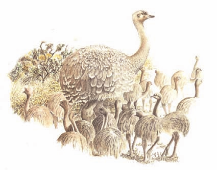

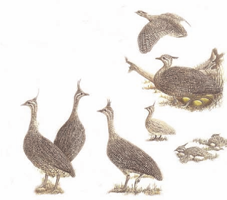

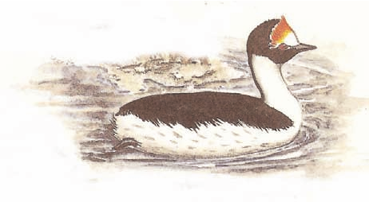

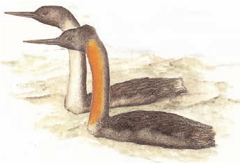

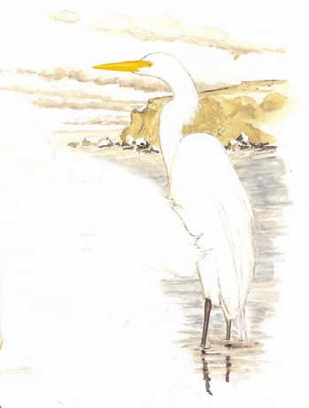

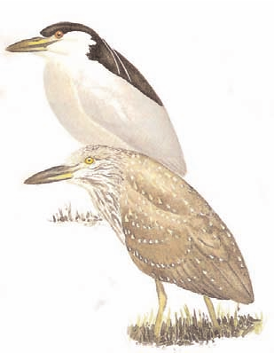

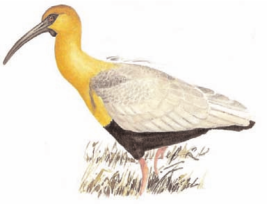

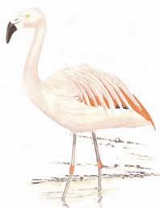

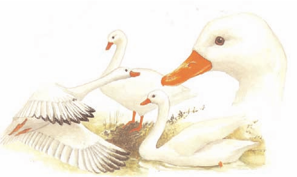

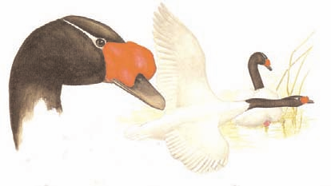 *<u>Cisne de Cuello
Negro</u>*

> ***Cygnus*** ***melancoryphus***
>
> ***Distribución***
>
> Se encuentra en toda la Patagonia, desde Río Negro y Neuquén hasta
> Tierra del Fuego, y ocasionalmente llega a las Islas Malvinas.
>
> ***Dimensiones***
>
> Mide 120 cm aproximadamente, la hembra es un poco más pequeña que el
> macho.
>
> ***Peso***
>
> Pesa de 4 a 7 Kg aproximadamente.
>
> ***Características*** ***morfológicas***
>
> Macho y hembra son iguales. La cabeza y el cuello son negros excepto
> por una línea blanca que corre del pico al cen-tro del ojo y se
> extiende hacia la parte posterior de la cabeza. El resto del plumaje
> es blanco. Presentan el pico color gris azulado con una carúncula roja
> que le crece sobre el mismo. Las patas son rosadas.
>
> ***Comportamiento*** ***general***
>
> Es de costumbres gregarias, se lo encuentra en grupos reducidos o muy
> numerosos. Casi siempre se lo puede obser-var nadando y cuando sale
> del agua permanece en las orillas de lagunas, lagos y ríos caudalosos
> pero de poca corren-tada. Durante su migración se lo puede observar en
> las costas de mar. Debido a su gran tamaño y peso, para levantar vuelo
> debe realizar un largo carreteo. Una vez en el aire se desplaza en
> vuelo rápido y su vigoroso aleteo produce un ruido audible a mucha
> distancia, al mismo tiempo que emite un silbido característico.
>
> ***Alimentación***
>
> Se alimenta básicamente de vegetación acuática.
>
> ***Reproducción***
>
> La temporada reproductiva oscila entre Agosto y Diciembre, pero en
> épocas favorables puede extenderse a gran parte del año. Nidifica en
> los juncales; el nido consiste en una amplia plataforma de juncos
> acolchada con abundante plu-món. Pone de 3 a 5 huevos,
> excepcionalmente 7, de color blanco crema y sólo la hembra se encarga
> de la incubación. Los pichones nacen cubiertos de un plumón blanco
> puro, manchado de gris en la zona dorsal. Ambos padres se encar-gan
> del cuidado de los pichones y suele vérselos transportarlos sobre su
> lomo.
>
> ***Estado*** ***de*** ***Conservación***
>
> Si bien las tendencias poblacionales no han sido cuantificadas, las
> condiciones actuales no harí-an pensar que su población esté
> disminu-yendo. Por tal motivo, en el año 2008,
>
> la UICN la ha clasificado como de *Preocupación* *menor* (LC).
>
> ***24***

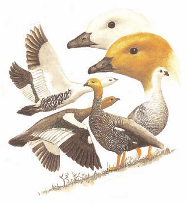

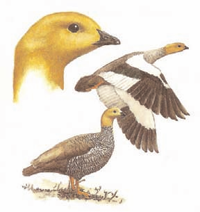

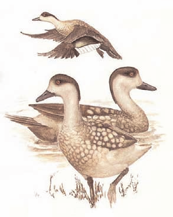

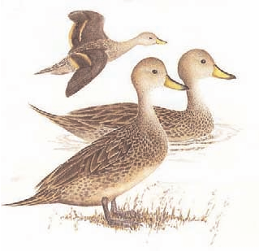

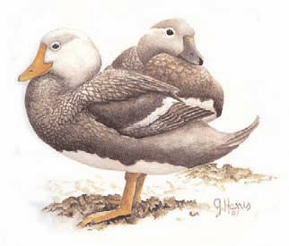

*Jote* *Cabeza* *Colorada* ***Cathartes*** ***aura***

> 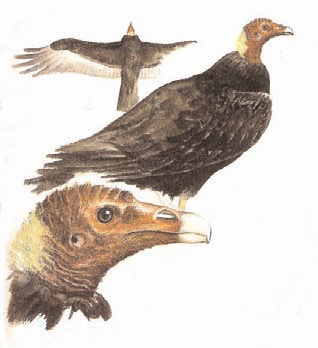 style="width:3.52395in;height:3.85132in" />***Distribución***
>
> De amplia distribución, se lo puede encontrar desde Canadá hasta
> Tierra del Fuego.
>
> ***Dimensiones***
>
> Mide 70 cm aproximadamente. La distancia entre las dos alas extendidas
> (envergadura alar) es de casi 2 m de
>
> largo. El macho es menor que la hembra.
>
> ***Peso***
>
> Pesa entre 1,4 y 2,7 Kg.
>
> ***Características*** ***morfológicas***
>
> Presenta la cabeza y la parte desnuda del cuello de color rojo, con
> una corona blanca. El pico es blanquecino, con su base roja. Los lados
> del
>
> cuello son amarillo pálido, el resto del cuello, en su parte
> emplumada, es pardo oscuro con reflejos metalizados verdes y azules.
> El pecho, el abdomen y el dorso son
>
> de color pardo muy oscuro. Las alas son, en su zona ventral, un poco
> más grisáceas. Las patas son de un color rosado fuerte.
>
> ***Comportamiento*** ***general***
>
> Es un ave muy común que se puede observar volando a baja altura, con
> un elegante planeo. Anda casi siempre en parejas, pero en sus lugares
> de descanso y alimentación se suelen reunir en grupos. Adaptado a todo
> tipo de ambientes, vive tanto en las calurosas zonas selváticas como
> en regiones montañosas o áridas de la estepa, o en las costas del mar.
>
> ***Alimentación***
>
> Se alimenta principalmente de carroña, pero también come reptiles y
> otros animales pequeños.
>
> ***Reproducción***
>
> Anida en árboles, en salientes o en repisas de paredones rocosos; o
> deja los huevos ocultos en la vegetación, direc-tamente en el suelo.
> Pone hasta 2 huevos de color blanco con pequeñas manchas pardo rojizas
> en una de las pun-tas del huevo. Ambos miembros de la pareja se
> encargan de la incubación y posterior alimentación y cuidado de los
> pichones.
>
> ***Estado*** ***de*** ***Conservación***
>
> Si bien las tendencias poblacionales de esta especie no han sido
> cuantificadas, las condiciones actuales no harían pensar que esté
> disminuyendo. Por tal motivo, en el año 2008, la UICN ha clasificado a
> esta especie como de *Preocupación* *menor* (LC).
>
> ***30***

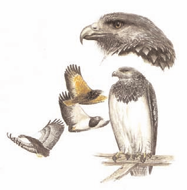

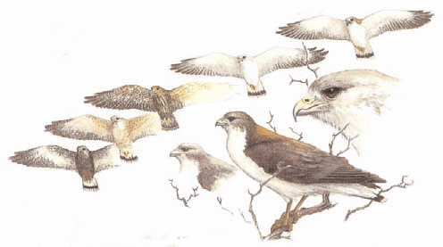

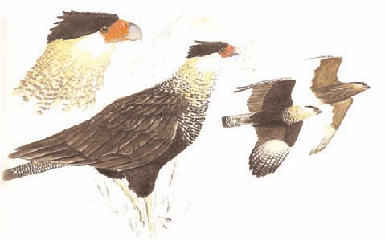

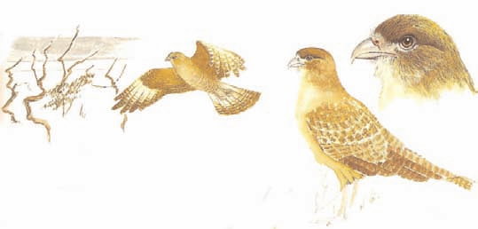

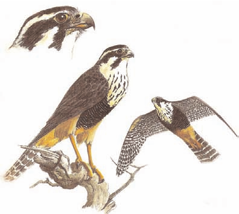

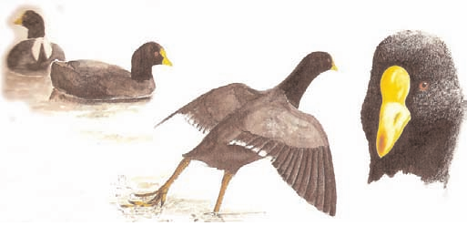

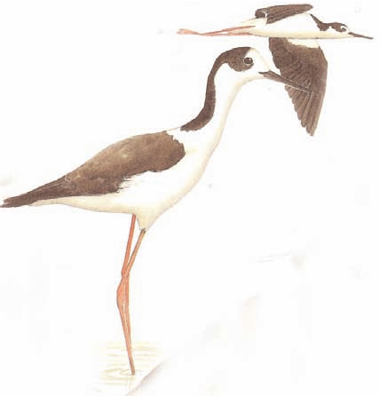

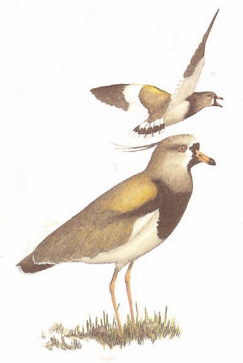

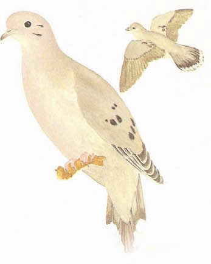

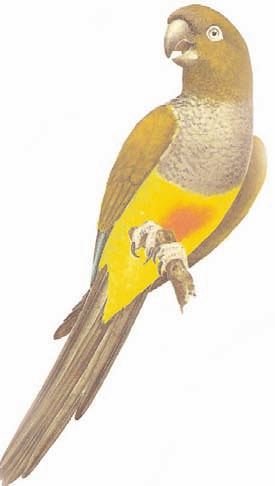

***Estado*** ***de*** ***Conservación***

Es una especie ampliamente distribuida. El tamaño de la población
mundial actual no se ha cuantificado, pero se la considera una especie
frecuente en todo su rango de distribución. Por este motivo la UICN, en
el año 2008, la ha cla-sificado como de *Preocupación* *menor* (LC). Sin
embargo, hay evidencia de una disminución en su población. Los loros
barranqueros han sido muy comunes en la Argentina pero en la actualidad
son solo localmente abundantes. Esta espe-cie ha desaparecido de la
provincia de Córdoba y en el Norte de la provincia de Buenos Aires es
solo un visitante oca-sional. Su disminución se debe a su persecución
como supuesta plaga de cultivos, a las modificaciones de su hábitat para
la actividad agrícola y a su captura para la comercialización como
mascotas.

> ***41***

*Lechuza* *de* *Campanario* ***Tyto*** ***alba***

> 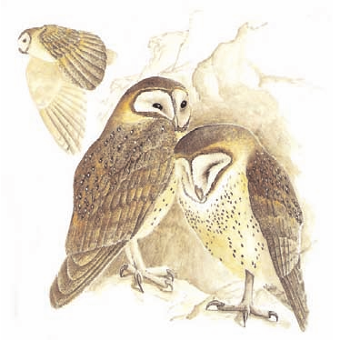 style="width:4.15131in;height:4.15131in" />***Distribución***
>
> Es una especie cosmopolita, ampliamente distribuida en el mundo.
>
> ***Dimensiones***
>
> Mide alrededor de 37 cm de alto y tiene 80 cm de enver-gadura alar
> (distancia entre las dos puntas de las alas exten-didas)
>
> ***Peso***
>
> Pesa 350 g aproximadamente, la hembra suele ser algo menor que el
> macho.
>
> ***Características*** ***morfológicas***
>
> Tiene el pico córneo color blanquecino y un característico disco
> facial blanco en forma de corazón, con una mancha pardo negruzca
> delante de los ojos. Las plumas que enmarcan el disco facial son de
> color dorado en las partes superiores y blancas y negras en la mitad
> inferior. El cuello, el pecho, y el abdomen son de color blanco con
> pequeñas manchas
>
> negruzcas. Las plumas de las patas y la cola son blancas. El resto del
> cuerpo, la zona dorsal y
>
> las alas, son de color pardo con manchas negruzcas. Los dedos de las
> patas son de color pardo grisáceo por arriba y blanquecino amarillento
> por debajo.
>
> ***Comportamiento*** ***general***
>
> Es una especie muy común, pero muy difícil de ver por sus hábitos
> nocturnos, rara vez sale a cazar de día. Generalmente se la encuentra
> en parejas que se refugian a descansar en grietas o cuevas de
> paredones rocosos y acan-tilados, huecos en los troncos de árboles,
> casas, galpones, torres, edificios en ruina y campanarios. Muy
> asociada a ambientes urbanos, en parte debido a su alimentación.
>
> ***Alimentación***
>
> Se alimenta de ratas y roedores pequeños principalmente. También
> consume aves, murciélagos, reptiles e insectos. Para cazar vuela en
> forma ondulante a baja altura y de noche.
>
> ***Reproducción***
>
> No construye un verdadero nido, pone hasta 10 huevos de color blanco
> en las mismas grietas y huecos que utiliza para descansar, en los
> lugares más oscuros y tranquilos. Estos lugares pueden reconocerse por
> el olor que emana de ellos, producto del regurgitado en forma de bolos
> (egagrópilas), compuesto de pelos y restos óseos de las presas que no
> puede digerir en combinación con sus excrementos. La hembra se encarga
> de la incubación de los huevos y el macho de su alimentación
> posterior. Los pichones nacen cubiertos por un espeso y largo plumón
> de color blanco.
>
> ***Estado*** ***de*** ***Conservación***
>
> Si bien las tendencias poblacionales no han sido cuantificadas, las
> condiciones actuales no harían pensar que su pobla-ción esté
> disminuyendo. Por tal motivo, en el año 2008, la UICN la ha
> clasificado como de *Preocupación* *menor* (LC).
>
> ***42***

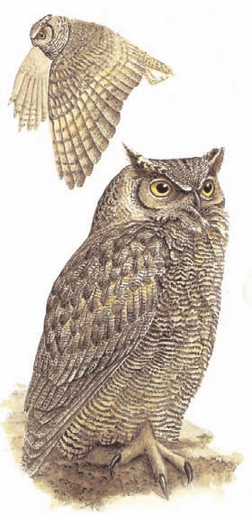

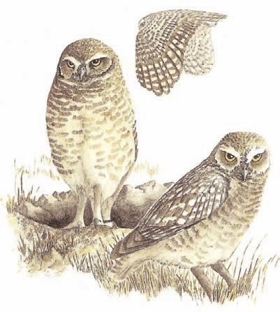*Lechucita* *Vizcachera*
***Athene*** ***cunicularia***

> ***Distribución***
>
> Es una especie natural de América. Su distribución se extiende desde
> Canadá hasta Chile y Argentina.
>
> ***Dimensiones*** Mide entre 18 y 26 cm.
>
> ***Peso***
>
> No disponible.
>
> ***Características***
>
> ***morfológicas***
>
> Posee la cabeza y partes superiores del cuerpo de color marrón terroso
> con manchas blancas, que se hacen más gruesas en el cuerpo. La
> gargan-ta y el cuello son blancuzcos y están separados por un collar
> oscuro. El abdomen y las plumas de la zona ven-tral de la cola son
> blanco cremoso. El pecho también pero pose manchas

más oscuras. Tiene las patas largas y la cola corta. La cola es marrón
amarillen-

> ta en el centro y blanquecina en los extremos. Los
>
> ojos son amarillos y las plumas de alrededor de los ojos, pardo
> oscu-ras. El pico es corto y ganchudo.
>
> ***Comportamiento*** ***general***
>
> Es de hábitos terrestres, aunque se posa sobre los postes de las
> cercas, piedras y otros objetos o lugares más altos que el relieve.
> Habita en lugares semiáridos, pastizales, sabanas, llanos y estepas.
> Se la puede ver sola o en parejas. Es acti-va durante la noche, pero
> se la ve también durante el día.
>
> ***Alimentación***
>
> Se alimenta de pequeños mamíferos, lagartijas, serpientes, ranas y
> también escorpiones.
>
> ***Reproducción***
>
> Anida en verano, en el hemisferio sur. Sus nidos son huecos excavados
> en la tierra, con túneles que llegan a medir hasta tres metros de
> largo. En estos huecos pueden criar colonias de hasta 12 parejas. La
> nidada puede llegar a contar con 12 huevos blancos, y es posible que
> en una temporada una pareja críe dos veces.
>
> ***Estado*** ***de*** ***Conservación***
>
> Es una especie ampliamente distribuida. Los parámetros poblacionales
> no han sido cuantificados, pero las condicio-nes actuales no harían
> pensar que esté en riesgo de disminuir. Por esta razón, la UICN en el
> año 2008, la ha clasifica-do como de *Preocupación* *menor* (LC).
>
> ***44***

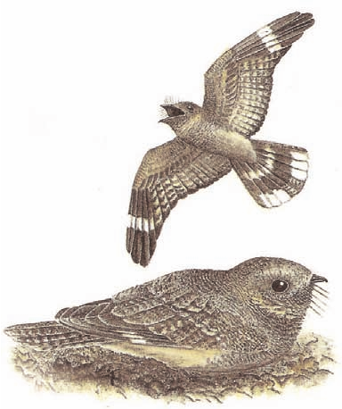

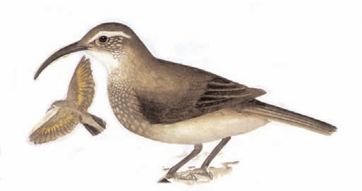*Bandurrita* *Común*
***Upucerthia*** ***dumetaria***

> ***Distribución***
>
> Es una especie natural de América del Sur. Su distribución comprende
> la región Andina desde el sur de Perú, Bolivia, prácticamente todo
> Chile y el occidente de Argentina hasta Tierra del Fuego.
>
> ***Dimensiones***
>
> Mide aproximadamente 20 cm.
>
> ***Peso***
>
> No disponible.
>
> ***Características*** ***morfológicas***
>
> Presenta el dorso de color castaño y el vientre blancuzco. Las plumas
> de la garganta y el cuello están bordeadas de color negruzco. Las
> plumas de la cola son parduscas. El pico es oscuro, largo, delgado y
> curvado hacia abajo.
>
> ***Comportamiento*** ***general***
>
> Habita en zonas semiáridas donde la vegetación predominante es
> herbácea con presencia de algunos arbustos.
>
> ***Alimentación***
>
> Su alimentación se basa en insectos. Camina rápidamente de un lado a
> otro picoteando el suelo para buscarlos.
>
> ***Reproducción***
>
> Anida en huecos o túneles que excavan en la tierra. La nidada consiste
> de 2 o 3 huevos. Los huevos son blanco opa-cos. Ambos padres alimentan
> a los pichones.
>
> ***Estado*** ***de*** ***Conservación***
>
> Si bien el tamaño de la población actual no se ha cuantificado, se la
> considera una especie frecuente en todo su rango de distribución. Por
> este motivo, en el año 2008, la UICN la ha clasificado como de
> *Preocupación* *menor* (LC).
>
> ***46***

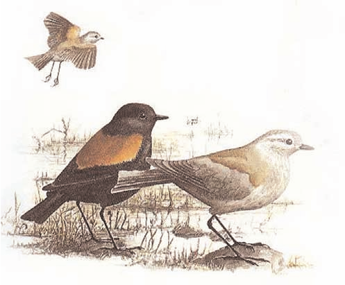

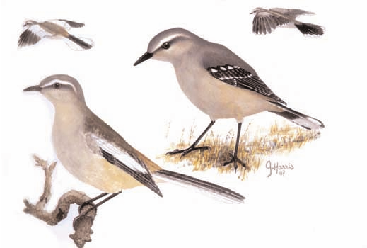

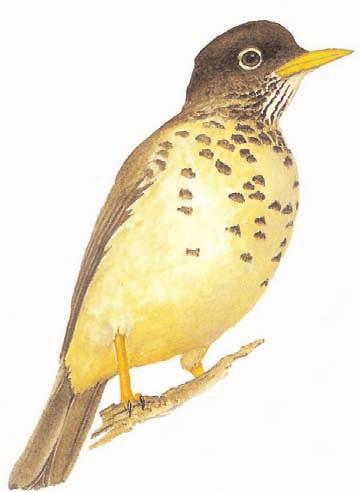

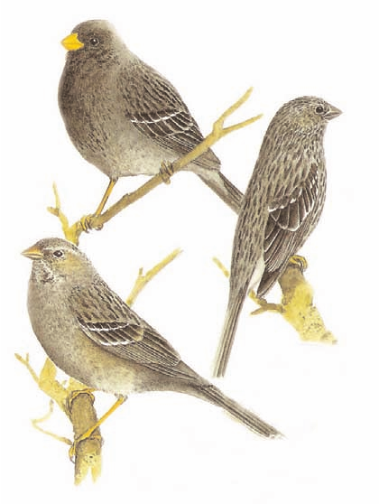

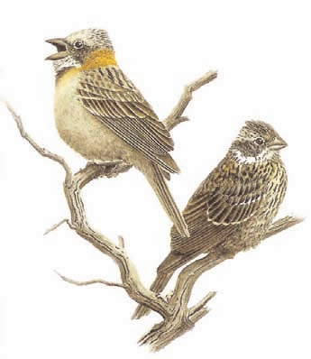

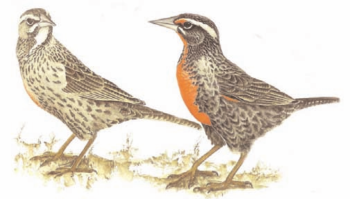

> ***Categorías*** ***utilizadas*** ***por*** ***UICN*** ***para***
> ***definir*** ***el*** ***estado*** ***de*** ***conservación***
> ***de*** ***las*** ***especies***

La abreviatura de las siglas para inventariar el estado de cada especie,
corresponde a su nomencla-tura en inglés:

**•** **EX** *Extinct.* *Extinto*. Se presume que una especie está
Extinta cuando prospecciones exhaustivas de sus hábitats, conocidos y/o
esperados, en los momentos apropiados (diarios, estacionales, anua-les),
y a lo largo de su área de distribución histórica, no han podido
detectar un solo individuo vivo.

**•** **EW** *Extinct* *in* *the* *wild.* *Extinto* *en* *estado*
*silvestre*. Una especie está Extinta en estado silvestre cuan-do sólo
sobrevive en cultivo, en cautiverio o como población (o poblaciones)
naturalizada comple-tamente fuera de su distribución original.

**•** **CR** *Critically* *endangered.* *En* *peligro* *crítico*. Una
especie está *En* *peligro* *crítico* cuando la mejor evidencia
disponible indica que cumple cualquiera de los criterios para esta
categoría, propuestas por la

Comisión de Supervivencia de Especies de UICN(1). Estos criterios están
relacionados con su tama-ño poblacional, con el grado de reducción del
mismo y de su distribución. Se considera que una espe-

cie en este estado está enfrentando un riesgo extremadamente alto de
extinción en estado silvestre.

**•** **EN** *Endangered.* *En* *peligro*. Categoría definida cuando la
especie responde a los criterios defini-dos para esta categoría(2)

**•** **VU** *Vulnerable.* *Vulnerable*. Categoría definida cuando la
especie responde a los criterios definidos para esta categoría (3).

**•** **NT** *Near* *threatened.* *Cercano* *a* *la* *amenaza*. Una
especie está en la categoría *Cercano* *a* *la* *amenaza*, cuando ha
sido evaluada según los criterios y no satisface, actualmente, los
criterios para *En* *peligro* *crítico*, *En* *peligro* o *Vulnerable*,
pero está cercana a satisfacer los criterios, o posiblemente los
satisfa-ga en un futuro cercano.

**•** **LC** *Least* *concern.* *Preocupación* *menor*. Una especie está
en la categoría *Preocupación* *menor* cuando habiendo sido evaluada, no
cumple ninguno de los criterios que definen a las categorías
anterio-res. Se incluyen en esta categoría especies abundantes y de
amplia distribución.

**•** **DD** *Data* *deficient.* *Datos* *insuficientes*. Una especie
pertenece a la categoría *Datos* *insuficientes* cuan-do no hay
información adecuada para hacer una evaluación, directa o indirecta, de
su riesgo de

> ***53***

extinción, con base en la distribución y/o el estado de la población.
Una especie en esta categoría puede estar bien estudiado y su biología
ser bien conocida, pero carecer de datos apropiados sobre su abundancia
y/o distribución. No es una categoría de amenaza.

**•** **NE** *Not* *evaluated.* *No* *evaluado*. Una especie se
considera No evaluada cuando todavía no ha sido clasificado en relación
a estos criterios.

(1), (2), (3) Hay un sistema jerárquico alfanumérico de criterios y
subcriterios para los niveles *En* *peligro* *crítico*, *En* *peligro*,
y *Vulnerable*, publicado en “Categorías y Criterios de la Lista Roja de
la UICN”, versión 3.1, preparado por la Comisión de Supervivencia de
Especies de UICN, aprobado en la 51º reunión del Consejo de la UICN,
Gland, Suiza, 9 febrero 2000. Para mayor información se puede contactar
al encargado del programa en redlist@ssc-uk.org., o consultar
http://www.iucnredlist.org/documents/redlist_cats_crit_sp_v1223290226.pdf

> ***54***

***Bibliografía*** ***consultada***

• Blanco, D. E., Zalva, S. M., Belenguer, C. J., Pugnali, G. y Rodríguez
Goñi, H. 2003. Estado de conservación del Cauquén colorado (*Chloëphaga*
*rubidiceps*) (Aves, Anatidae) en su zona de inver-nada (Provincia de
Buenos Aires, Argentina). Revista Chilena de Historia Natural 76 (1):
47-55.

• Chebez, J.C. 1999. Los que se van. Especies argentinas en peligro.
Editorial Albatros.

• Harris, G. 2008. Guía de aves y mamíferos de la costa patagónica. El
Ateneo.

• Kovacs, C. J., Kovacs, O., Kovacs, Z., y Kovacs, C. M. 2005. Manual
Ilustrado de Aves de la Patagonia, Antártida Argentina e Islas del
Atlántico Sur. Museo Ornitológico Argentino. El Bolsón, Provincia de Río
Negro, Argentina.

• Narosky, T., Yzurieta, D. 1993. Guía para la identificación de las
aves de Argentina y Uruguay. Vázquez Manzini Editores.

• Trejo, A., Kun, M. y Seijas, S. 2006. Dieta del águila mora
(*Geranoaetus* *melanoleucus*) en una tran-secta oeste-este en el
ecotono norpatagónico. Hornero 21 (1): 31-36.

**Páginas** **web** **consultadas**

• Página web de la Asociación Ornitológica del Plata:
<u>http://ww</u>wave<u>sa</u>r<u>gentina</u>s.<u>o</u>rg.<u>ar</u>

• Pagina web de Cornell Lab of Ornithology:
<u>http://ww</u>w<u>bi</u>rds.<u>cornell.edu/AllAboutBi</u>r<u>ds</u> •
Página web del Zoológico Electrónico:
<u>http://ww</u>w<u>damisela.com/</u>zo<u>o/inde</u>x<u>.htm</u>

> ***55***

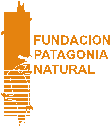

> Consolidación e Implementación del Plan de Manejo Integrado

de la Zona Costera Patagónica para la Conservación de la Biodiversidad
ARG/02/G31
